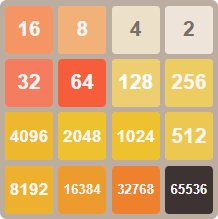

<h1>2048 to 65k</h1>


A modern implementation of the classic **2048 game**, built with **React + TypeScript**.  
This version challenges you to go **beyond 2048 all the way to 65,536**,
<br/>
so the target board is:
</br>
</br>
Built with ❤️ by Inbar and Tal Segal. August 2025.

---

🎮 **Play it now in your browser:**  
👉 [2048 to 65k on GitHub Pages](https://talseg.github.io/react-2048/)

---

## 🎮 Features
- Supports Destop and phone browsers.
- Strives to exercise clean code principles:
  - Prefer readability over short or overly clever code.
  - Separate logic from UI for clarity and maintainability.
  - Keep developer tools clean — no warnings, no unnecessary logs or noise.
- Swipe support (keyboard and touch).
- Unlimited Undo system.
- Optional hints to help with strategy.
- **Storybook integration** for developing UI components in isolation.
- 100% open code for learning and contributions.

---

## 🚀 Getting Started

### Prerequisites
- [git](https://git-scm.com/)
- [Node.js LTS](https://nodejs.org/)
- yarn (Optional)

### Installation
```bash
# Clone the repo
git clone https://github.com/talseg/react-2048.git
cd react-2048


# Install dependencies
npm install
# or
yarn install
```

### Run locally
```bash
npm run dev
# or
yarn dev
```

Open [http://localhost:5173](http://localhost:5173) in your browser.

---

## 📜 License

This project is released under the [MIT License](./LICENSE) with additional terms described in [LICENSE_EXTRA.md](./LICENSE_EXTRA.md).

- ✅ Free for personal use, learning, and contributions.  
- 🚫 Not allowed without permission: publishing as an app on Google Play, Apple App Store, or similar platforms.  
- 🚫 Not allowed without permission: using for commercial purposes (selling, licensing, monetizing).

---

## 🙏 Acknowledgments
- Inspired by the original [2048 game](https://play2048.co/) by [Gabriele Cirulli](https://github.com/gabrielecirulli) (MIT License).  
- Built with [Vite](https://vitejs.dev/) and [Storybook](https://storybook.js.org/).
- Built by Tal and Inbar Segal using React and TypeScript.
